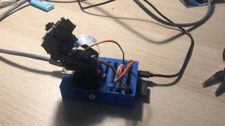

# Motion Servo Camera

A simple web interface for viewing and controlling a Raspberry Pi camera with servos




## Hardware Requirements

- 1x Raspberry Pi (I'm currently using an old RPi v1B)
- 1x Raspberry Pi Camera Module: https://www.jaycar.com.au/5mp-camera-for-raspberry-pi/p/XC9020
- 2x 9G servos: https://www.jaycar.com.au/arduino-compatible-9g-micro-servo-motor/p/YM2758
- 1x Pan Tilt Camera Bracket: https://www.jaycar.com.au/pan-and-tilt-action-camera-bracket-mount-for-9g-servos/p/XC4618

## Software Requirements

- Raspbian lite
- motion: https://motion-project.github.io/motion_guide.html
- nginx
- python3
- python3-pip

### Software Install

#### Clone repo to correct location on pi
```
git clone https://github.com/se1exin/servocam.git ~/servocam

cd ~/servocam
```

#### Install system dependencies
```
sudo apt update && sudo apt install motion nginx python3 python3-pip
```

#### Enable Raspberry Pi Camera
```
sudo raspi-config
```
Go to `Interfacing Options` > `Camera` > `Yes`. Exit out to save and then reboot the pi.

#### Setup motion
Edit the motion conf file.
```
sudo nano /etc/motion/motion.conf
```
Make the following changes to improve framerate, enable remote access, and run on boot:

- `daemon on`
- `width 640`
- `height 480`
- `framerate 10`
- `locate_motion_mode off`
- `ffmpeg_output_movies off`
- `stream_motion off`
- `stream_maxrate 10`
- `stream_localhost off`
- `webcontrol_port 0`

```
sudo nano /etc/default/motion
```
Change `start_motion_daemon=no` to `start_motion_daemon=yes`

Enable the motion systemd daemon
```
sudo systemctl enable motion
```
Make sure permissions are correctly set on the motion log file
```
sudo chown -R motion: /var/log/motion
```

Reboot and check camera is available at `http://raspberrypi:8081` after the pi has booted.


#### Install python dependencies
```
# Run inside this repo/directory

sudo pip3 install -r requirements.txt
```

#### Setup Gunicorn
```
sudo cp gunicorn.service /etc/systemd/system/gunicorn.service
sudo systemctl daemon-reload
sudo systemctl enable gunicorn
sudo systemctl start gunicorn
```

#### Setup nginx
```
sudo mv /etc/nginx/sites-available/default_old
sudo cp nginx-site.conf /etc/nginx/sites-available/default
sudo systemctl enable nginx
sudo systemctl restart nginx

```

### Reboot
Everything should now be installed. Reboot.
```
sudo reboot
```

The interface should be available at `http://raspberrypi`


## Resources

- https://raspberrypi.stackexchange.com/questions/41342/how-to-start-motion-in-daemon-mode-on-rpi-running-raspbian-jessie 
- https://www.e-tinkers.com/2018/08/how-to-properly-host-flask-application-with-nginx-and-guincorn/

